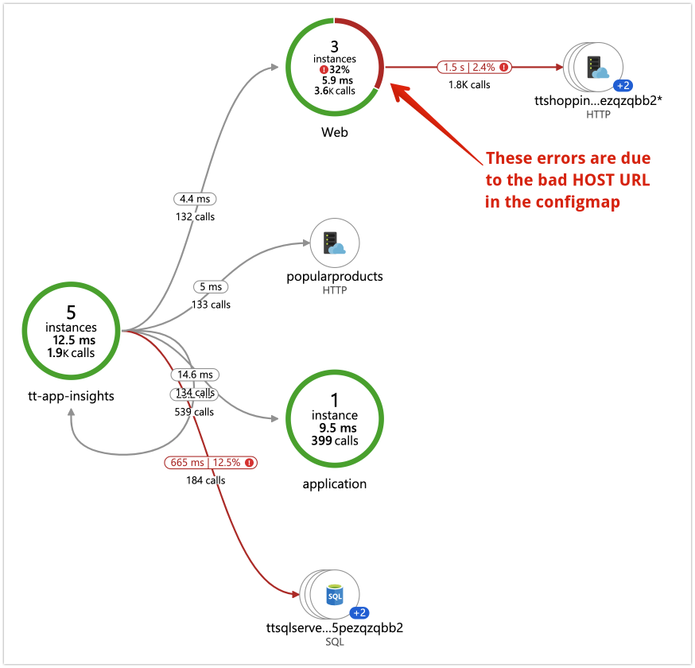

# Demo 3: Remediation of Shopping Cart

>**On Stage Demo Video:**<br/>
[Demo 3: Remediation of Shopping Cart (7:00)](https://globaleventcdn.blob.core.windows.net/assets/ops/ops20/video/demo_3_full.mp4)

[](https://globaleventcdn.blob.core.windows.net/assets/ops/ops20/video/demo_3_full.mp4)

**Question:** *What are we trying to demonstrate?*

**Answer:** We are demonstrating several tools within the Azure ecosystem that can help reduce the time to recover from a service disruption.

This demo touches on five (6) unique products within the Azure ecosystem we will use to "respond" & "remediate" an active "incident". We will navigate through a number of tools beginning with the Application Dashboard.

> **Presenter Setup Checklist:**

- [ ] Azure Service Health Open in new tab (because it often takes too long to load live)

## Part 1: Azure Dashboard

The Dashboard is not created automatically during the deployment. Create the dashboard used in this demonstration, simply press the "Application Dashboard" button found in Application Insights.

From the Dashboard, we will explore the following tools:

## Part 2: Azure Service Health

Click to the tab wher Azure Service Health has already been opened prior to the presentation and explain the service. It is designed to show you problems that may be occuring in Azure that could be affecting your services. 

## Part 3: Application Map

From the Azure Application Map we should be able to see problems occuring in the connection between the front end of the system and the database.



## Part 5: Log Analytics

Demonstrate the multiple tables and features of Log Analytics such as the ability to use predefined queries, and save your own.

## Part 6: KQL (Kusto Query Language)

Demonstrate querying any part of the system by manually typing in the following query because we *"want to see all log entries that contain something about the cart"*.

``` KQL
ContainerLog | where LogEntry contains "cart"
```

End of demonstration.
