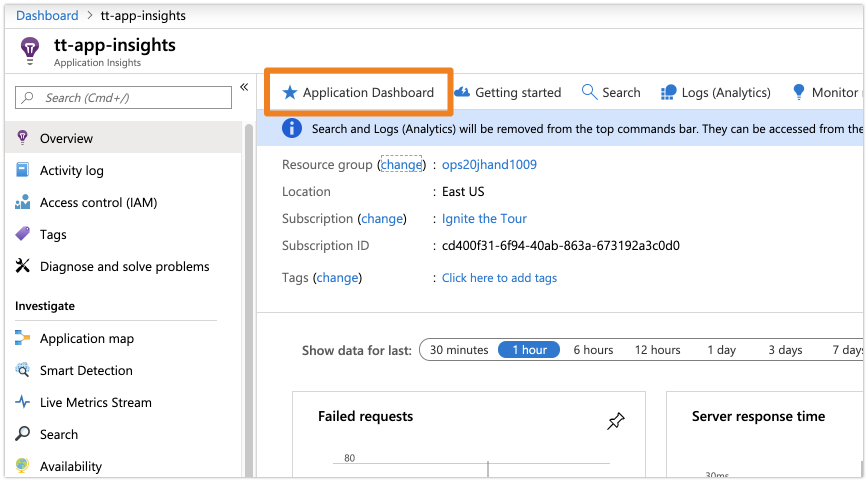
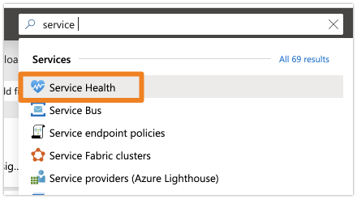

# Dashboard Setup

An Application Dashboard is used in demo 3.

The dashboard is not immediately available upon the completion of the deployment. You (the presenter) will need to manually create the dashboard.

However, most of the dashboard can be automatically created after the deployment simply by navigating to `Application Insights` and pressing the "Application Dashboard" button found near the top of the screen as shown below.

Once you have created the main dashboard, we will add a few extra components.

We need to add a block for `Azure Service Health` so we can access it quickly from the dashboard in the demo.

## Add Service Health Block

Search for `service` in the top bar and select **Service Health** from the options that display.

From the Service Health screen, simply press the push-pin displayed in the upper right to add a block to the Application Dashboard created in the previous step.

>**Presenter Note** You may need to edit the dashboard and move the new block to the top.
