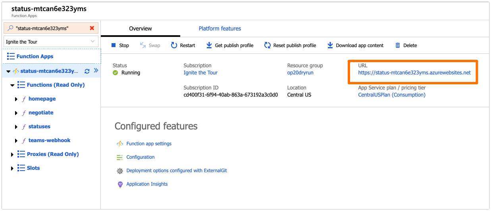
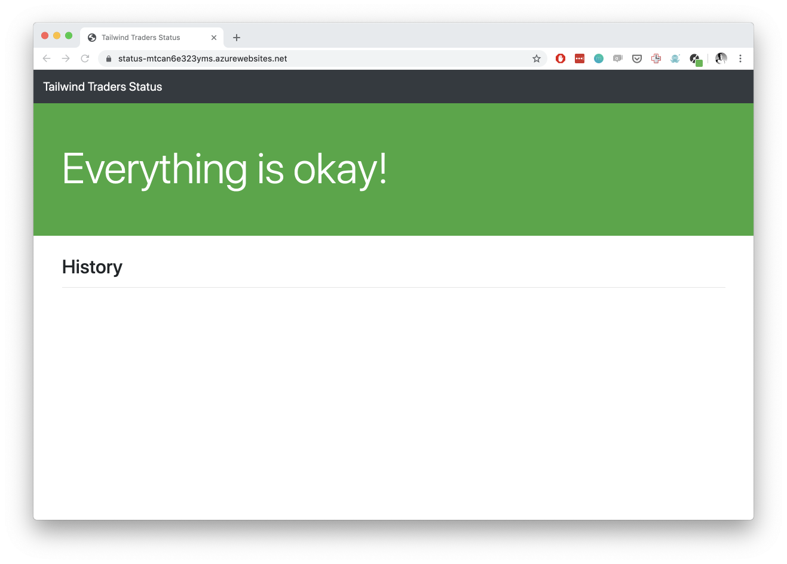

# Status Page Update Via Chatbot

The Status Page portion of the demo utilizes a webhook in Microsoft Teams to trigger an Azure Function which then updates HTML on a file stored in a web server on Azure Storage.

The Azure Function and associated storage files are part of the automated deployment.

## Post-Deployment Instructions

The deployment will provide nearly everything you need to demonstrate a status page update. However, you will need to perform a few actions in Microsoft Teams that cannot be automated during the deployment.

### Create Outgoing Webhook

Navigate to the function app, and open the `teams-webhook` function.

Click "**Get Function URL**" and copy the URL.

Finally, open Teams and navigate to the "Apps" page of the team in which you want to create the bot.

Click "**Create outgoing webhook**".

Use `StatusPage` as the bot name (this is hardcoded, for now).

Paste in the function URL, and enter a description.

You will be prompted with a secret code for validating webhook calls from Teams.

We currently do not use this.

Close the dialog box.

>**Note:** Reference this [repository](https://github.com/Azure-Samples/functions-teams-incident-status-page-bot) for additional information on installation and configuration of the status page update process using chatops.

### View the Status Page

You can access your status page HTML by clicking on the link displayed in the overview screen of the Azure Function.

There, you'll see something like the following image, indicating that "Everything is okay!"... and there should be no text below the **History** section.

