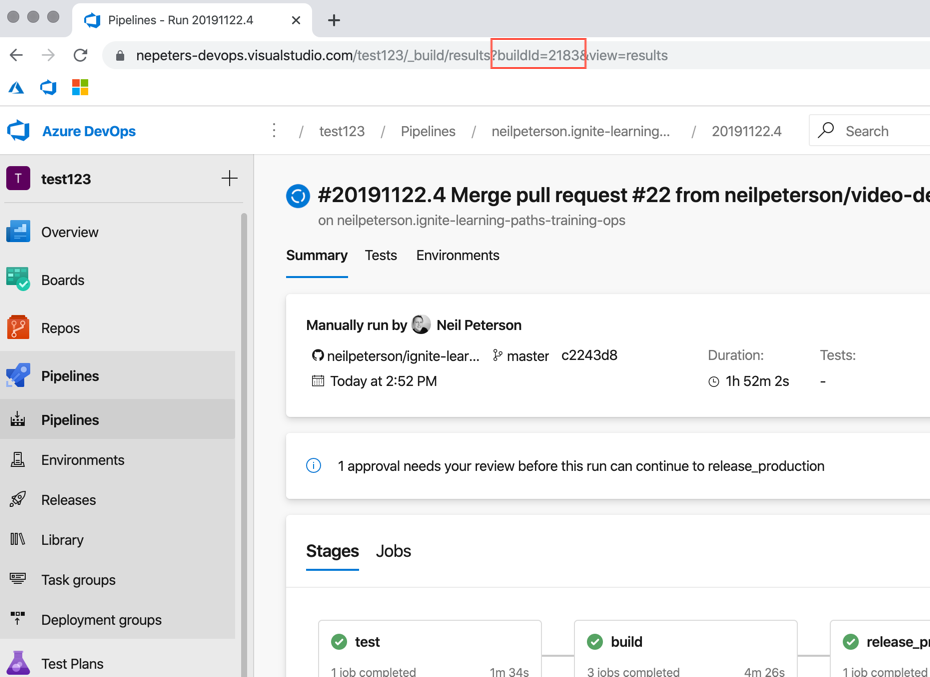

First, deploy the Tailwind Traders application onto a Kubernetes cluster. Deployment steps and automation can be found here:

https://github.com/microsoft/ignite-learning-paths/tree/master/ops/deployment

Once completed, fork this repo into your own GitHub account and clone to your development system.

https://github.com/microsoft/ignite-learning-paths.git

Update the values in the `/ops/ops40/demos/azure_pipeline/azure-pipelines.yaml` file to match the AKS and ACR deployments. The following commands can be used to find these values.

```
az acr list -o table
az aks list -o table
```

Once done, push the updates back to GitHub. This file is used in demo 1 when creating an Azure Pipeline.

### Create Azure Pipeline Service Connection

This step was originally part of the demo however can take a few minutes to complete. To expedite the process I recommend configuring the service connection before starting the demo.

1. Navigate to the new Azure DevOps organization, and then the new DevOps project.

2. Select **Project settings** > **Service connections** > **New service connection** > **Azure Resource Manager**.

3. Enter a connection name of `azure-service-connection`, select the appropriate Azure subscription, and select **OK**.

### Optional: Break Tailwind Traders

If you would like to break the Tailwind app and show remediation using an Azure DevOps pipeline, here is a quick way to do so.

Edit the configmap for the TWT cart api:

```
kubectl edit configmap cfg-my-tt-cart
```

Update the `HOST` value so that it is not valid. In the following example, I have removed `https` from the URL. Once done save the configmap.

```
HOST: ://ttshoppingdbt6grppp3eluvk.documents.azure.com:443/
```

Next, the cart pod needs to be restarted, which will take in the new value and effectively break the Tailwind cart.

Return a list of pods

```
$ kubectl get pods

NAME                                                        READY   STATUS    RESTARTS   AGE
my-tt-cart-7cd4cbd744-j6ngl                                 1/1     Running   0          18m
my-tt-coupon-tt-coupons-85c96964fc-4r9zn                    1/1     Running   0          19m
my-tt-image-classifier-7d6d97875f-f8sjp                     1/1     Running   0          18m
my-tt-login-7f88cff49-5d876                                 1/1     Running   0          19m
my-tt-mobilebff-67dcb9f988-w6xjr                            1/1     Running   0          18m
my-tt-popular-product-tt-popularproducts-67dfcc8b67-qx5fg   1/1     Running   0          19m
my-tt-product-tt-products-d9c54d955-z8nf4                   1/1     Running   0          19m
my-tt-profile-5c57bf89b4-zjqdf                              1/1     Running   0          19m
my-tt-stock-6b969dd459-zptrz                                1/1     Running   0          19m
my-tt-webbff-67849c78b7-bjd5n                               1/1     Running   0          18m
web-6b56cc7d7c-ws7v4                                        1/1     Running   0          18m
```

Delete the `my-tt-cart` pod:

```
kubectl delete pod my-tt-cart-7cd4cbd744-j6ngl
```

## Demo 1 - Azure DevOps

### Demo broken application

If you have elected to break the Tailwind Traders app, you can demo the break here. To get the address of the application run the following command.

```
$ k get ingress
NAME                                       HOSTS                                   ADDRESS        PORTS   AGE
my-tt-cart                                 d4aa3f5a552742c8be0f.eastus.aksapp.io   40.71.39.243   80      30h
```

Browse to the `HOSTS` address and click on the tailwind cart icon.

### Create Pipeline

1. Select **Pipelines** from the left hand Azure DevOps menu.

2. If prompted, select **Try it!** to enable the new unified YAML pipeline experience.


3. Select **Create Pipeline**.

4. Select **GitHub YAML** and then select the **ignite-learning-paths** repo fork. You should have created this repo during set up.

5. Select **Existing Azure Pipelines YAML file** for the project type.

6. Browse the repository and select the **azure-pipelines.yml** file.

7. Select **Continue** to create the pipeline.

8. Click **Run** to save and run the pipeline.

### Pipeline Overview

While the pipeline is running, explain stages and jobs while looking at the pipeline overview.


Open up the pipeline YAML, and detail the following items:

- [Stages](https://docs.microsoft.com/en-us/azure/devops/pipelines/process/stages?view=azure-devops&tabs=yaml)
- [Jobs](https://docs.microsoft.com/en-us/azure/devops/pipelines/process/phases?view=azure-devops&tabs=yaml)
- [Trigger](https://docs.microsoft.com/en-us/azure/devops/pipelines/build/triggers?view=azure-devops&tabs=yaml)
- [Path filter](https://docs.microsoft.com/en-us/azure/devops/pipelines/build/triggers?view=azure-devops&tabs=yaml#paths)
- [Pull request trigger](https://docs.microsoft.com/en-us/azure/devops/pipelines/build/triggers?view=azure-devops&tabs=yaml#pr-triggers)
- [Variables](https://docs.microsoft.com/en-us/azure/devops/pipelines/process/variables?view=azure-devops&tabs=yaml%2Cbatch)
- [Variable groups](https://docs.microsoft.com/en-us/azure/devops/pipelines/library/variable-groups?view=azure-devops&tabs=yaml)
- [Conditions](https://docs.microsoft.com/en-us/azure/devops/pipelines/process/conditions?view=azure-devops&tabs=yaml)
- [Tasks](https://docs.microsoft.com/en-us/azure/devops/pipelines/process/tasks?view=azure-devops&tabs=yaml)
- [environments](https://docs.microsoft.com/en-us/azure/devops/pipelines/process/environments?view=azure-devops)

### Production Reconciliation

At this point, hopefully, the pre-production deployment has completed. Show how production can be reconciled .via build ID (helm release version and container image version).

1. Get the latest build id, this can be seen in the last runs URL.



2. Navigate back to the pipeline YAML and show how the built-in `Build.BuildId` variable can be used as a task value.

```
- task: HelmDeploy@0
  displayName: 'helm package (tt-cart)'
  inputs:
    command: package
    chartPath: 'Deploy/helm/cart-api'
    arguments: '--version $(Build.BuildId)'
```

3. Return a list of helm release, and show that the chart used to release the `CHART` has a version that matches the build-id.

```
$ helm list

NAME                    REVISION        UPDATED                         STATUS          CHART                           NAMESPACE
my-tt-cart              3               Mon Oct 14 13:14:25 2019        DEPLOYED        cart-api-1                      default
```

4. Return a list of pods to get the name of the cart pod.

```
$ kubectl get pods

my-tt-cart-cart-api-77db6f9f58-wqs7p                        1/1     Running   0          11h
my-tt-coupon-tt-coupons-85c96964fc-z7tc7                    1/1     Running   0          15h
my-tt-image-classifier-7d6d97875f-4z66s                     1/1     Running   0          15h
my-tt-login-7f88cff49-fqk95                                 1/1     Running   0          15h
my-tt-mobilebff-67dcb9f988-7vgc9                            1/1     Running   0          15h
my-tt-popular-product-tt-popularproducts-67dfcc8b67-f7knj   1/1     Running   0          15h
my-tt-product-tt-products-d9c54d955-6fmd8                   1/1     Running   0          15h
my-tt-profile-5c57bf89b4-5z79c                              1/1     Running   0          15h
my-tt-stock-6b969dd459-hw559                                1/1     Running   0          15h
my-tt-webbff-67849c78b7-qhvlg                               1/1     Running   0          15h
web-6b56cc7d7c-w7t9x                                        1/1     Running   0          15h
```

5. Describe the cart pod to see the Docker image used to start it. Note that the image version matches the Build ID.

```
$ kubectl describe pod my-tt-cart-cart-api-77db6f9f58-wqs7p

Containers:
  cart-api:
    Container ID:   docker://9438c601b838855659abef2f68ab19c281bd172525ce09aedbbcf65dc0940580
    Image:          ttacr5iny4v2wygm3k.azurecr.io/cart.api:1818
```

### Add Unit Test

1. Add the following stage to the pipeline, click **Save**, which will start a new run.

```
- stage: test
  jobs:
  - job: tests

    variables:
      hostDB: https://ttshoppingdbt3wkbtypkhaaw.documents.azure.com:443/

    pool:
      name: Hosted Ubuntu 1604

    steps:

    - task: PowerShell@2
      displayName: Install Pester
      inputs:
        targetType: 'inline'
        script: |
          Find-Module pester | Install-Module -Force

    - task: AzureCLI@1
      displayName: Generate values file for test
      inputs:
        azureSubscription: $(azureSubscription)
        scriptLocation: 'inlineScript'
        inlineScript: |
          pwsh ./ops/deployment/helm-values/generate-config.ps1 -resourceGroup $(aks-cluster-rg-pre-prod) -sqlPwd Password2020! -gvaluesTemplate ops/deployment/helm-values/gvalues.template -outputFile ./values.yaml

    - task: PowerShell@2
      displayName: Parse host name
      inputs:
        targetType: 'inline'
        script: |
          $content = Get-Content values.yaml
          $hostName = $content[37].split(" ")[7]

    - task: PowerShell@2
      displayName: Run Pester tests
      inputs:
        targetType: 'inline'
        script: 'invoke-pester -Script @{ Path = ''./ops/ops40/demos/azure_pipeline/tests/''; Parameters = @{ hostName = ''$(hostDB)'' }} -OutputFile "./test-results.xml" -OutputFormat ''NUnitXML'''

    - task: PublishTestResults@2
      displayName: Publish test results
      inputs:
        testResultsFormat: 'NUnit'
        testResultsFiles: '**/test-results.xml'
        failTaskOnFailedTests: true
```

2. The test takes a few minutes to run. Use this time to show off these other features and things.

- [Environments and manual approvals](https://docs.microsoft.com/en-us/azure/devops/pipelines/process/environments?view=azure-devops)
- Pipeline logs
- [Azure Pipeline YAML reference](https://docs.microsoft.com/en-us/azure/devops/pipelines/yaml-schema?view=azure-devops&tabs=schema)

3. Once the testing stage has completed, show the test results.


## Teardown instructions

When done the demo environment can be deleted using the following command:

```
az group delete --name <resource group name> --yes --no-wait
```

The Azure DevOps organization also needs to be deleted. This can be done from the settings for the organization.